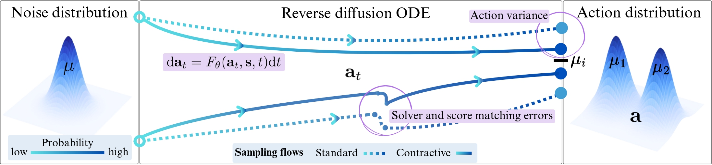

## Abstract

Diffusion policies have emerged as powerful generative models for offline policy learning, whose sampling process can be rigorously characterized by a score function guiding a stochastic differential equation (SDE). However, the same score-based SDE modeling that grants diffusion policies the flexibility to learn diverse behavior also incurs solver and score-matching errors, large data requirements, and inconsistencies in action generation. While less critical in image generation, these inaccuracies compound and lead to failure in continuous control settings. We introduce contractive diffusion policies (CDPs) to induce contractive behavior in the diffusion sampling dynamics. Contraction pulls nearby flows closer to enhance robustness against solver and score-matching errors while reducing unwanted action variance. We develop an in-depth theoretical analysis along with a practical implementation recipe to incorporate CDPs into existing diffusion policy architectures with minimal modification and computational cost. We evaluate CDPs for offline learning by conducting extensive experiments in simulation and real-world settings. Across benchmarks, CDPs often outperform baseline policies, with pronounced benefits under data scarcity.



## Citation

```bibtex
@inproceedings{abyaneh2026contractive,
  title     = {Contractive Diffusion Policies: Robust Action Diffusion via Contractive Score-Based Sampling with Differential Equations},
  author    = {Abyaneh, Amin and Morissette, Charlotte and Danesh, Mohamad H. and Houssaini, Anas and Meger, David and Dudek, Gregory and Lin, Hsiu-Chin},
  booktitle = {International Conference on Learning Representations (ICLR)},
  year      = {2026},
  url       = {https://openreview.net/forum?id=iKJbmx1iuQ}
}
```
