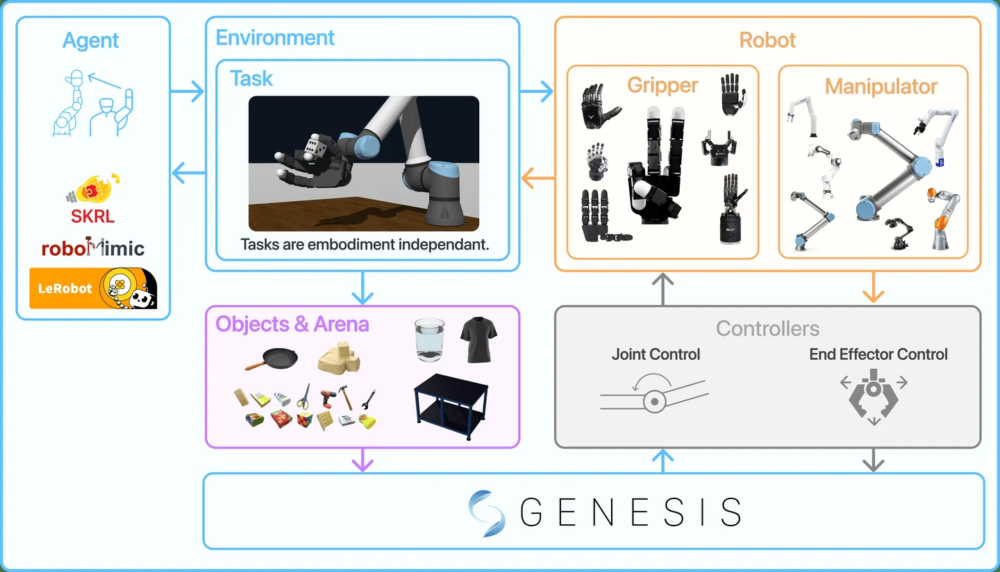

## Abstract

Dexterous multi-fingered hands promise far richer manipulation skills than simple parallel grippers, yet most existing benchmarks and datasets still target low-DoF end-effectors. In an era where increasingly advanced physical hands are being developed at high speed, we lack a unified, low-cost simulation and benchmarking environment to study dexterous control. We introduce DexSuite, a modular framework that standardizes observations, action spaces, and evaluation protocols for multi-fingered hands while remaining easily extensible to new robots, environments, and tasks. Alongside the framework, we release a curated dataset of over 150k frames of multi-modal hand interaction, collected with a Manus glove on a suite of manipulation tasks, providing high-fidelity supervision of finger motion and contact-rich interactions. DexSuite also offers benchmark tasks and baselines spanning imitation learning, reinforcement learning, and diffusion policies, enabling fair comparison across algorithm families and hand representations, and providing a common testbed for systematic study of robotic dexterity.

## Framework

DexSuite separates a base environment from modular tasks and uses robot abstractions to pair any manipulator with any gripper or multi-finger hand, in single-arm or bimanual settings, across rigid, articulated, and deformable objects. It ships with a teleoperation and data toolchain (keyboard, Vive trackers, and Manus gloves with geometric retargeting), dataset loaders in the LeRobot format with converters to RoboMimic and RLDS, and a curated benchmark of environments spanning more than twenty arm–hand configurations.
