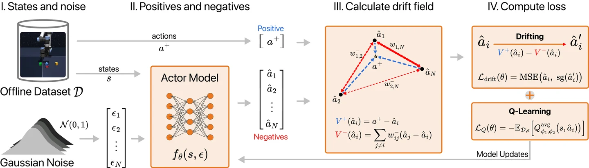

## Abstract

Offline reinforcement learning requires improving a policy from fixed data while avoiding out-of-distribution actions with unreliable value estimates. Diffusion and flow policies handle this trade-off by modeling the behavior distribution to regularize the RL objective, but they require iterative denoising, solver integrations, and in more efficient variants, distillation or other approximations at inference. We propose DriftQL, which combines a drift-based behavioral regularizer with critic-driven policy improvement. The value signal biases the policy toward high-value regions of the data support, while attraction and repulsion together keep generated actions near the data and prevent collapse onto a single mode. DriftQL is implemented as a single network with a unified training objective and generates actions in a single forward pass. On D4RL and OGBench, DriftQL consistently outperforms diffusion and flow methods, advancing the state of the art. Under degraded data quality, where the baselines visibly struggle, DriftQL remains close to its clean-data performance, positioning it as a promising alternative to diffusion and flow-based methods while maintaining the simplicity and efficiency of deterministic approaches.



## Citation

```bibtex
@inproceedings{houssaini2026drift,
  title     = {Drift Q-Learning},
  author    = {Houssaini, Anas and Danesh, Mohamad H. and Abyaneh, Amin and Fujimoto, Scott and Lin, Hsiu-Chin and Meger, David},
  booktitle = {Advances in Neural Information Processing Systems (NeurIPS)},
  year      = {2026},
  url       = {https://arxiv.org/abs/2606.00350}
}
```
