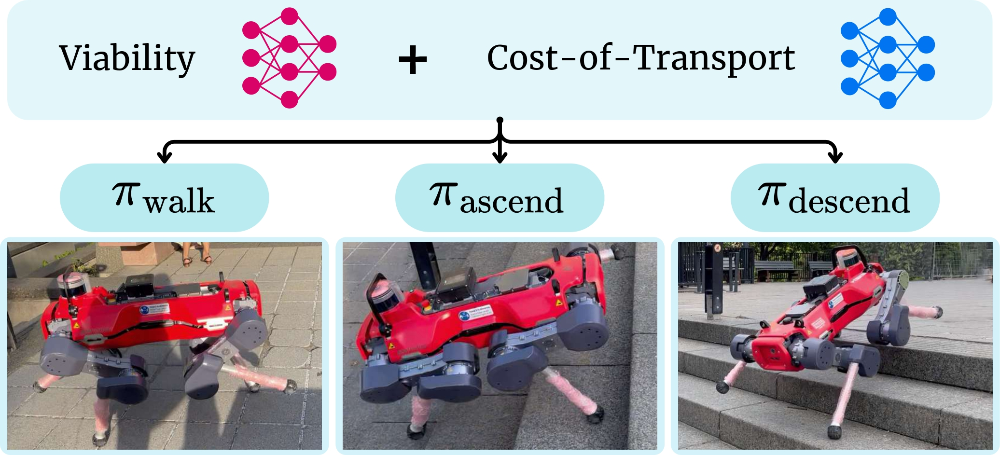

---

##### Links

+ [Paper](https://arxiv.org/pdf/2510.23997)
+ [Project page](https://sites.google.com/view/vocaloco)

---

##### Abstract

Recent advancements in legged robot locomotion have facilitated traversal over increasingly complex terrains. Despite this progress, many existing approaches rely on end-to-end deep reinforcement learning (DRL), which poses limitations in terms of safety and interpretability, especially when generalizing to novel terrains. To overcome these challenges, we introduce VOCALoco, a modular skill-selection framework that dynamically adapts locomotion strategies based on perceptual input. Given a set of pre-trained locomotion policies, VOCALoco evaluates their viability and energy-consumption by predicting both the safety of execution and the anticipated cost of transport over a fixed planning horizon. This joint assessment enables the selection of policies that are both safe and energy-efficient, given the observed local terrain. We evaluate our approach on staircase locomotion tasks, demonstrating its performance in both simulated and real-world scenarios using a quadrupedal robot. Empirical results show that VOCALoco achieves improved robustness and safety during stair ascent and descent compared to a conventional end-to-end DRL policy

---

##### Citation

"VOCALoco: Viability-Optimized Cost-aware Adaptive Locomotion."

```latex
@misc{wu2025vocalocoviabilityoptimizedcostawareadaptive,
      title={VOCALoco: Viability-Optimized Cost-aware Adaptive Locomotion},
      author={Stanley Wu and Mohamad H. Danesh and Simon Li and Hanna Yurchyk and Amin Abyaneh and Anas El Houssaini and David Meger and Hsiu-Chin Lin},
      year={2025},
      eprint={2510.23997},
      archivePrefix={arXiv},
      primaryClass={cs.RO},
      url={https://arxiv.org/abs/2510.23997},
}
}
