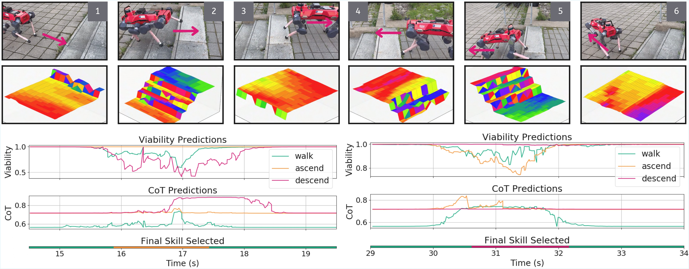

## Abstract

Recent advancements in legged robot locomotion have facilitated traversal over increasingly complex terrains. Despite this progress, many existing approaches rely on end-to-end deep reinforcement learning (DRL), which poses limitations in terms of safety and interpretability, especially when generalizing to novel terrains. To overcome these challenges, we introduce VOCALoco, a modular skill-selection framework that dynamically adapts locomotion strategies based on perceptual input. Given a set of pre-trained locomotion policies, VOCALoco evaluates their viability and energy-consumption by predicting both the safety of execution and the anticipated cost of transport over a fixed planning horizon. This joint assessment enables the selection of policies that are both safe and energy-efficient, given the observed local terrain. We evaluate our approach on staircase locomotion tasks, demonstrating its performance in both simulated and real-world scenarios using a quadrupedal robot. Empirical results show that VOCALoco achieves improved robustness and safety during stair ascent and descent compared to a conventional end-to-end DRL policy.



## Citation

```bibtex
@article{wu2025vocaloco,
  title   = {VOCALoco: Viability-Optimized Cost-aware Adaptive Locomotion},
  author  = {Wu, Stanley and Danesh, Mohamad H. and Li, Simon and Yurchyk, Hanna and Abyaneh, Amin and El Houssaini, Anas and Meger, David and Lin, Hsiu-Chin},
  journal = {IEEE Robotics and Automation Letters},
  volume  = {11},
  number  = {2},
  pages   = {1146--1153},
  year    = {2025},
  doi     = {10.1109/LRA.2025.3632604},
  url     = {https://doi.org/10.1109/LRA.2025.3632604}
}
```
